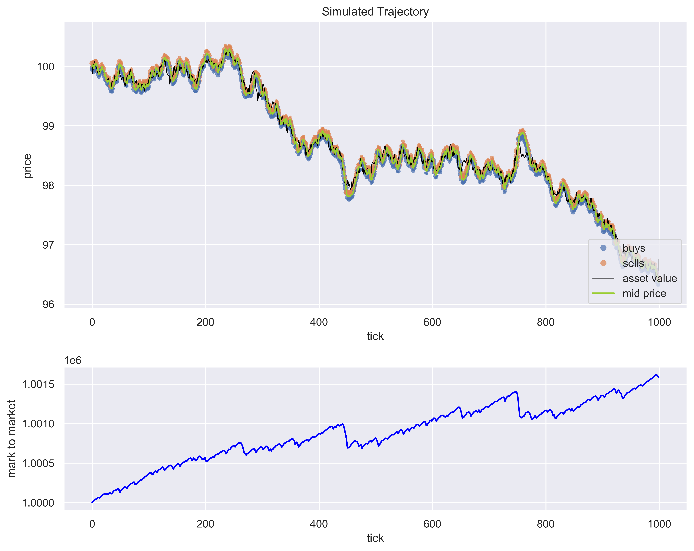
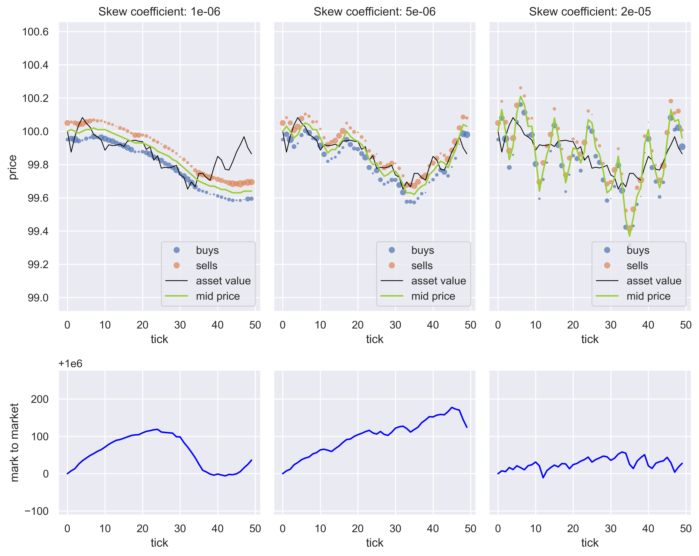
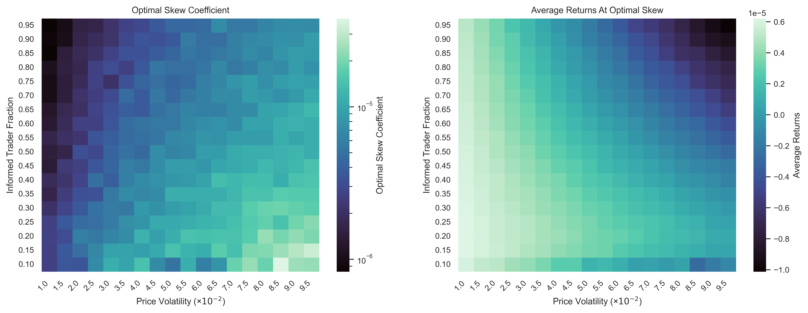
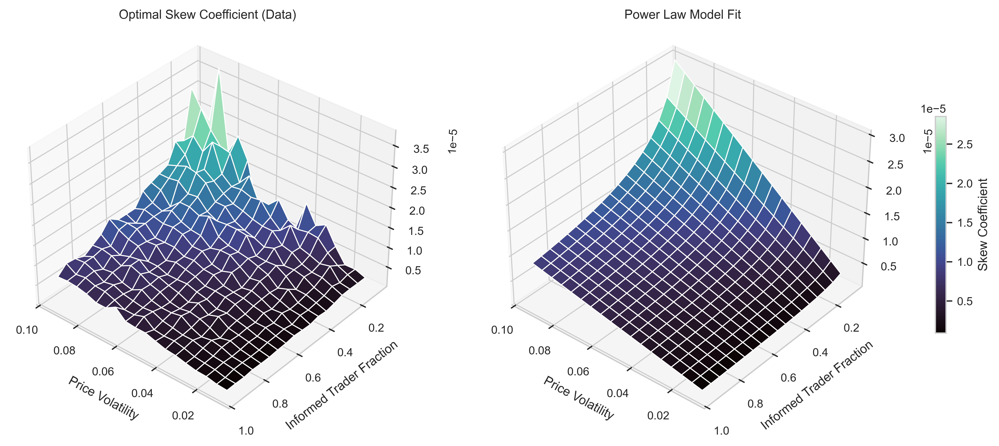
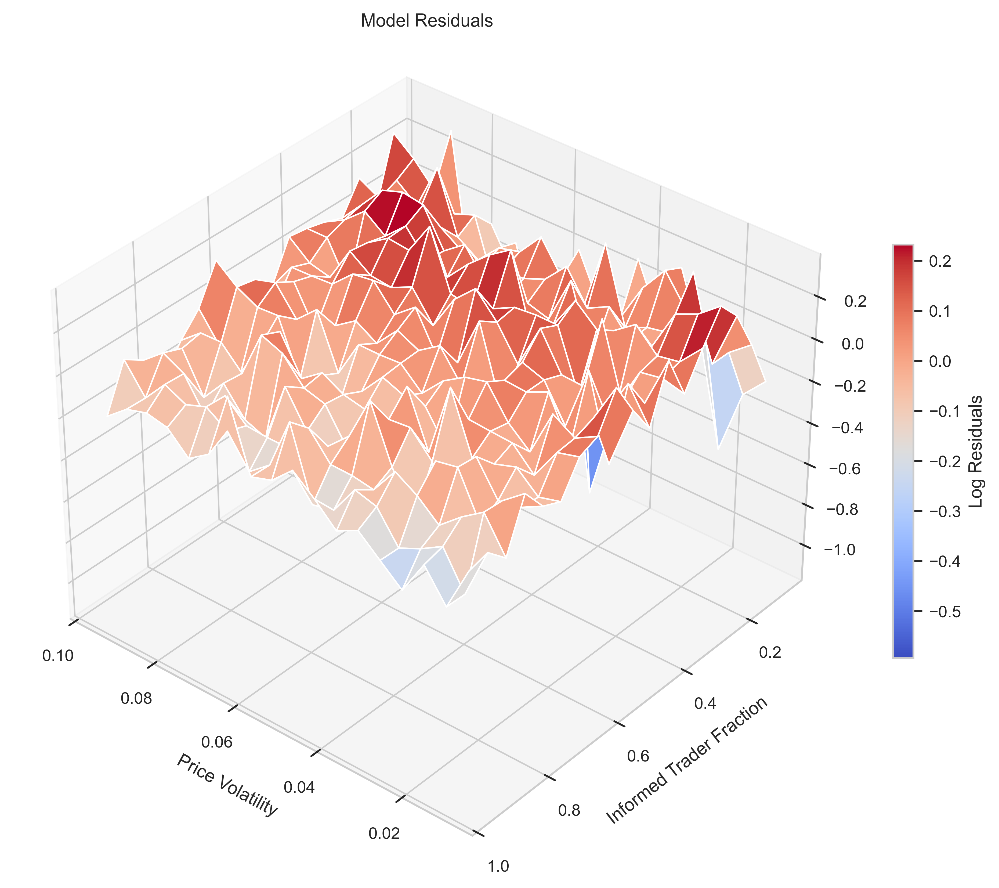
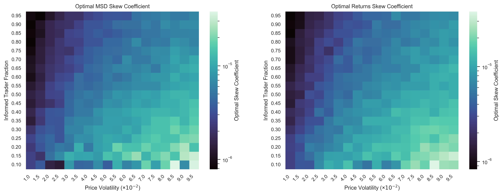
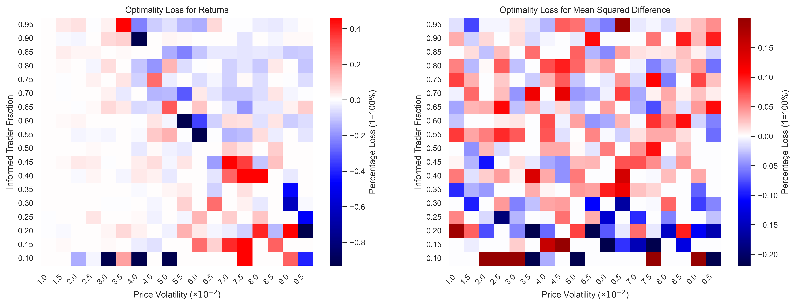

# Endogenous Pricing and Market Maker Profit Maximization

# Introduction

Market makers are often described as liquidity providers, but this characterization obscures their deeper function in price discovery. A fundamental question in market microstructure is: what mechanism compels market makers to set efficient prices?

Most academic models (e.g., Avellaneda–Stoikov) assume the mid-price evolves exogenously as an Ito process, treating it as an external environmental factor to which the market maker responds. While this framework is useful for deriving closed-form optimal strategies, it sidesteps the question of how prices come to reflect fundamental value in the first place. If market makers simply quote around an externally given mid-price, they are passive participants in price formation rather than active contributors to price discovery.

This report investigates price formation through an endogenous pricing framework where no stochastically evolving mid-price is directly observable to the market maker. Instead, the market maker must discover the asset's fundamental value through the only signal available: the inventory consequences of its trading decisions. The central hypothesis is that profit maximization naturally compels efficient pricing—that is, a market maker optimizing for long-run profitability will converge toward quoting prices that accurately reflect the asset's fundamental value.

## Environment Setup

The foundation of this investigation is the L3 limit order book (LOB) system that I engineered from scratch, which forms the entire simulation environment.
Its construction is a significant part of the contribution of this project, and the results in subsequent sections rely critically on its correct functioning and performance characteristics.

Key architectural and performance features of the L3 LOB:
- Price–Time Priority Matching Engine
- Price priority implemented using a binary heap for each side of the book.
- Within each price level, orders are managed as FIFO queues.
- Quote insertions execute in $O(\log N)$ time, where $N$ is the number of active price levels.
- Cancellations run in $O(M)$ time, where $M$ is the number of resting orders at the price level (typically $M=1$ in these experiments).
- This design supports millions of matching operations per experiment with stable performance.
- Multi-Agent Compatibility Built In
The engine maintains trader IDs, trade receipts (“notifications”), and order ownership, enabling easy calculation of agent-level statistics such as PnL decomposition, position trajectories, markouts, and Sharpe ratios.
These features allow experiments involving multiple competing agents, market makers, or heterogeneous flow models without altering the core matching engine.
- Full L3 Simulation at High Throughput
The simulator processes ~12,500 market orders per trajectory and ~3.5 billion matching operations across the full grid search.
The system is architected to support parallel workload execution across market regimes, making large-scale microstructure experiments computationally feasible on a laptop.

The results that follow are interpretable because the L3 engine behaves like a real exchange matching system—book dynamics, inventory accumulation, and adverse selection pressures all arise endogenously.

## Model Setup
The simulation employs the minimal possible setup to observe endogenous price discovery:

**Informed Traders:** Have access to the asset's fundamental value, which evolves as a random walk with normally distributed increments.
$$S_t = S_{t-1} + \sigma \epsilon$$
Where $\epsilon \sim \mathcal{N}(0, 1)$. 
Order arrivals follow a Poisson process with uniformly distributed integer volumes: If $K_t$ is the number of arrivals per tick, $V_{t,i}$ is the volume of the $i$th order at time $t$
$$K_t \sim Poisson(\lambda) , \quad V_t \sim Unif(V_{min},...,V_{max})$$
Each order is a market order that crosses the spread. Crucially, each order has probability $p$ of trading in the direction of the fundamental value (informed flow) and probability $1-p$ of trading against it (noise flow).

**Monopolistic Market Maker:** Posts two-sided quotes at a fixed spread s with no direct observation of the fundamental value. The market maker's only information channel is the inventory built from trading with informed and uninformed order flow. To manage inventory risk, the market maker employs a linear skewing strategy:

$$
\begin{align*}
B_t &= \text{mid}_t - \frac{s}{2} - c \cdot I_t \cdot \text{mid}_t  \\
A_t &= \text{mid}_t + \frac{s}{2} - c \cdot I_t \cdot \text{mid}_t
\end{align*}
$$

Where $c$ is the skew coefficient and $I_t$ is the signed inventory position (so that $I_t \cdot \text{mid}_t$ is the signed dollar exposure).

The mechanism of price discovery is adverse selection: when the market maker overvalues an asset, informed traders sell at the inflated price, causing toxic inventory accumulation that would realize losses if prices corrected. The market maker's skewing response to this inventory buildup constitutes its pricing adjustment toward fundamental value.

## Illustrative Example
The following simulation demonstrates that the mechanism can produce endogenous pricing. With an appropriately calibrated skew coefficient, the market maker's mid-price tracks the fundamental asset value despite having no direct observation of it:

Notably, the market maker achieves positive mark-to-market returns, suggesting that its pricing strategy—derived purely from inventory management—successfully navigates the adverse selection imposed by informed traders. This raises two critical questions that we investigate in the subsequent analysis:

**Optimal Skewing:** How does the optimal skew coefficient depend on market conditions (volatility, informed trader fraction)?

**Efficiency and Profit:** Is efficient pricing indeed the profit-maximizing strategy, or is this an artifact of particular parameter choices?

The remainder of this report addresses these questions through systematic experimentation, demonstrating that profit-driven market making endogenously produces efficient price discovery.

# Optimal Skewing

An exploratory visual analysis suggests that an appropriate skew coefficient makes the market maker sufficiently sensitive to inventory accumulation to track the asset’s fundamental value, while avoiding overreaction to weak signals. Economically, the market maker must be willing to unwind positions when the estimated fundamental value deviates from the mid-price, but must not overpay in doing so.

From this we anticipate:
	1.	Higher asset volatility → higher optimal skew coefficient.
When the asset value fluctuates more, the market maker needs greater sensitivity to keep up with the volatility of the fundamental process.
	2.	Higher informed-trader fraction → lower optimal skew coefficient.
When the signal is stronger, the market maker requires less sensitivity to track the underlying trajectory effectively.

### Methodology

I use Monte Carlo simulation combined with a two-stage grid search to optimise the skew coefficient across a discrete set of market regimes. For each regime (\sigma, \gamma), I compute optimal skew coefficients and evaluate two distinct metrics at the optimum. I consider a grid of 324 regimes, where:
- $\sigma = \{0.005 + 0.005i\}_{i=1}^{18}$ represents asset value volatility,
- $\gamma = \{0.05 + 0.05 i\}_{i=1}^{18}$ represents the informed-trader fraction.

At every regime point I run a coarse and then a fine log-linear grid search. Initial probing indicated a power-law relationship between the optimal skew and the regime parameters, motivating a log-spaced search. At each $(\sigma, \gamma, c)$, I simulate 10 trajectories and average the optimisation metric across them.

In the full experiment, I use a 20-point coarse grid and a 10-point fine grid, optimising three metrics (final PnL, average returns, and the mean squared distance to the fundamental value). The total number of simulated trajectories is:

$10 \times 324 \times 30 \times 3 = 291{,}600$

For each trajectory, an L3 limit order book is simulated with matching logic applied to roughly 12,500 market orders. Altogether, the experiment performs approximately 3.5 billion matching operations, which is computationally expensive given a pure Python implementation. To make it feasible on a laptop, I distribute computation regime-by-regime and execute tasks in parallel.

### Results 

The results confirm the expected behaviour for both return-optimised and final-mark-to-market–optimised skew coefficients. In fact, the optimal coefficients for these two metrics coincide. The heat map below displays results for the more robust metric of average returns.

The two summary tables below verify the expected monotonicity: for fixed informed fraction, higher volatility implies a higher optimal skew; for fixed volatility, a higher informed fraction implies a lower optimal skew.

## Fixed Informed Fraction (0.5)

|   price volatility |   optimal sc-returns |   average returns |        final pnl |
|-------------------:|---------------------:|------------------:|-----------------:|
|               0.02 |          3.1e-06 |       4.8e-06  |      1.00479e+06 |
|               0.04 |          4.5e-06 |       2.8e-06 |      1.00281e+06 |
|               0.06 |          8.9e-06 |       7.4e-07 |      1.00074e+06 |
|               0.08 |          1.1e-05 |      -1.4e-06  | 998638           |

## Fixed Price Volatility (0.05)

|   informed fraction |   optimal sc-returns |   average returns |        final pnl |
|--------------------:|---------------------:|------------------:|-----------------:|
|                 0.2 |          1.1e-05 |       3.4e-06 |      1.00344e+06 |
|                 0.4 |          8.2e-06  |       2.6e-06 |      1.00246e+06 |
|                 0.6 |          5.5e-06  |       9.7e-07 |      1.00097e+06 |
|                 0.8 |          4.8e-06 |      -6.0e-07 | 999402           |

A further observation from the heat map is that along level sets of the optimal skew, both higher volatility and higher informed-trader fraction tend to reduce returns. This aligns with economic intuition:
- higher informed fraction => higher adverse-selection cost and fewer opportunities for profitable trades with noise traders,
- higher volatility => higher inventory risk and thus higher effective cost of inventory management.

This becomes more intuitive once combined with the hypothesis—confirmed in the next section—that an optimally performing market maker in this model also achieves optimal price discovery.

Finally, I fit a log–log power-law regression for the optimal skew coefficient as a function of the regime variables. As the exploratory analysis suggested, the fit is extremely good: R^2 = 0.94, with large t-statistics.

Fitting: $\log(c^*) \sim \beta_0 + \beta_1 \cdot \log(\gamma) + \beta_2 \cdot \log(\sigma)$

| Variable | Coefficient | Std Error | t-statistic | P>\|t\| |
|----------|-------------|-----------|-------------|-------|
| const | -9.3515 | 0.0530 | -176.480 | 0.0000 |
| informed fraction | -0.5655 | 0.0162 | -34.986 | 0.0000 |
| price volatility | 1.0007 | 0.0162 | 61.906 | 0.0000 |

**Model Diagnostics:**
- R-squared: 0.9403
- Adjusted R-squared: 0.9399
- F-statistic: 2528.16

Plotting the model surface alongside the empirical data confirms the tightness of the fit:

Residuals show slight kurtosis, potentially attributable to interaction effects. I tested an interaction term $\log(\sigma)\log(\gamma)$, but it did not materially reduce the kurtosis. Although richer models could be explored, the explanatory power and interpretability of this simple specification justify not extending the analysis further.

# Efficiency and Profit

At the outset, we hypothesised that price discovery and profit motive would be aligned. This would be reflected empirically if the skew coefficient that minimises price inefficiency were the same—or very close to—the skew that maximises returns.

### Methodology

We compare skew coefficients optimised for two objectives:
1.	Market efficiency:
The mean squared distance (MSD) between the mid-price and the asset’s fundamental value (as observed by informed traders). This serves as our proxy for price-discovery quality.
2.	Profitability: The average per-tick return $$E\left[\frac{W_{t+1} - W_t}{W_t}\right]$$ where W_t denotes the market maker’s wealth at time t.

The optimisation procedure is identical to that described in the previous section.

To evaluate the robustness of these optima, we perform additional Monte Carlo simulations to measure optimality loss: the expected relative drop in objective value when using the “wrong” skew.

Let:
- $c_{\text{ret}}$ be the skew optimised for returns,
- $c_{\text{msd}}$ be the skew optimised for MSD,
- $J_{\text{ret}}(c) = E(\text{returns} \mid c)$,
- $J_{\text{msd}}(c) = E(\text{msd} \mid c)$.

We compute:

$$\text{OL}_{\text{ret}} =
\frac{J_{\text{ret}}(c_{\text{ret}}) - J_{\text{ret}}(c_{\text{msd}})}
{J_{\text{ret}}(c_{\text{ret}})}$$

$$\text{OL}_{\text{msd}} =
\frac{J_{\text{msd}}(c_{\text{ret}}) - J_{\text{msd}}(c_{\text{msd}})}
{J_{\text{msd}}(c_{\text{msd}})}.$$

Since MSD is a minimisation objective, we flip the sign to cast the problem in maximisation form.

All simulations are run regime-by-regime in parallel to reduce computation time. 

### Results 

#### Optimal skews for MSD vs returns
Placing the two optimal skew heat maps side by side reveals a close qualitative similarity: both surfaces share the same monotone structure across regimes.

To quantify the divergence, we compute the multiplicative difference:

$$\exp \left(|\log(c_{\text{ret}}) - \log(c_{\text{msd}})|\right) - 1
= \max \left(\frac{c_{\text{ret}}}{c_{\text{msd}}},\frac{c_{\text{msd}}}{c_{\text{ret}}}\right) - 1$$

This yields a median multiplicative deviation of 11% across all regimes.

| Metric | Median | 10th Quantile | 25th Quantile | 75th Quantile | 90th Quantile | Min | Max |
|--------|------|-----|-----|-----|-----|-----|------|
| optimal sc-returns vs optimal sc-msd (log diff) | 1.137395e-01 | 0.000000e+00 | 2.729673e-02 | 2.742750e-01 |3.815000e-01 | 0.000000e+00 | 4.310632e+00

This metric reflects parameter-space curvature rather than economic impact: a large multiplicative difference may correspond to either a tiny or substantial change in actual objective value, depending on the flatness of the loss surface at that regime.

#### Optimality loss in returns and MSD

To evaluate economic significance, we compute relative objective loss at each regime.
The resulting heat maps show the spatial distribution of these losses:

Two features stand out:
1.	Diagonal band with large relative loss:
These correspond to near-zero returns, causing denominators in the relative-difference formula to vanish and artificially inflate the value.
2.	Low-informed regimes:
Here we observe significant deviations. A plausible explanation is the prevalence of short-term profitable “pegging” strategies: in low-information environments, the mid-price moves too slowly for inventory risk to materialise over the finite simulation horizon.

Negative optimality losses also appear. These occur when the sample average of one objective is accidentally higher at the suboptimal skew due to Monte Carlo noise. Under the hypothesis that true optima are close, this is expected. If:

$$\hat{J}(c) = J(c) + \epsilon$$

then

$$\frac{\hat{J}(c_{\text{ret}}) - \hat{J}(c_{\text{msd}})}{\hat{J}(c_{\text{ret}})}
\approx \frac{2\epsilon}{\hat{J}(c_{\text{ret}})}$$

which is symmetric around zero.

#### Quantitative Summary

From the table below, for the optimality loss in returns, two points are notable:
1.	The median loss is 0.
2.	50% of regimes exhibit a return loss below 2.6%, and 80% fall below 10%.

Thus, in half of all tested regimes, using the MSD-optimal skew alters average per-tick returns by less than 2.6%.

For MSD, the results are similar: using the returns-optimal skew often produces nearly identical efficiency, and deviations are generally small.

| Metric | Median | 10th Quantile | 25th Quantile | 75th Quantile | 90th Quantile | Min | Max |
|--------|------|-----|-----|-----|-----|-----|------|
| optimality loss returns | 0.000000e+00 | -9.689516e-02 | -2.552320e-02 | 1.251754e-02 |7.669934e-02 | -3.972085e+00 | 6.483526e+00
| optimality loss msd | 0.000000e+00 | -5.353169e-02 | -1.279841e-02 | 3.645422e-02 |7.604807e-02 | -7.386804e-01 | 2.832303e+00

Outliers are predominantly explained by the same two effects: near-zero returns and pegging behaviour.

_________
Within this simplified market environment, we can say with confidence that profit incentives and market efficiency are closely aligned: the skew coefficient that produces efficient pricing typically produces optimal returns, and vice versa, with economically small deviations across most regimes.

# Conclusion

This study demonstrates the following:
1. Endogenous asset pricing arises naturally from interactions between a monopolistic market maker managing inventory risk and discretionary traders submitting orders against it.
2. The optimal skew coefficient follows a power-law relationship in the regime variables—price volatility and informed-trader fraction. The resulting model is highly interpretable and fits the empirical surface extremely well.
3. Incentives for price discovery and profit are aligned. A skew that maximises returns nearly always minimises pricing inefficiency, with economically small deviations across most regimes.

## Further Research 
Several extensions would strengthen the analysis:
1. Monte Carlo estimation of parameter uncertainty.
Re-estimating the optimal skew multiple times per regime would allow decomposition of error into Monte Carlo noise versus grid-discretisation effects.
2. Formal hypothesis testing for
$H_0: c_{\text{ret}} = c_{\text{msd}}$
This would provide a rigorous statistical grounding for the observed alignment between efficiency and profitability.

## What I learned 

What I Learned
1. The central role of market makers in price discovery and liquidity provision. The spread is fundamentally the cost of immediacy and price certainty.
2.	The importance of inventory management as protection against adverse selection and as a determinant of profitable quoting behaviour.
3.	How to design robust, modular simulation infrastructure in Python, with clean separation of concerns, parallel execution, and reproducible Monte Carlo experiments.

