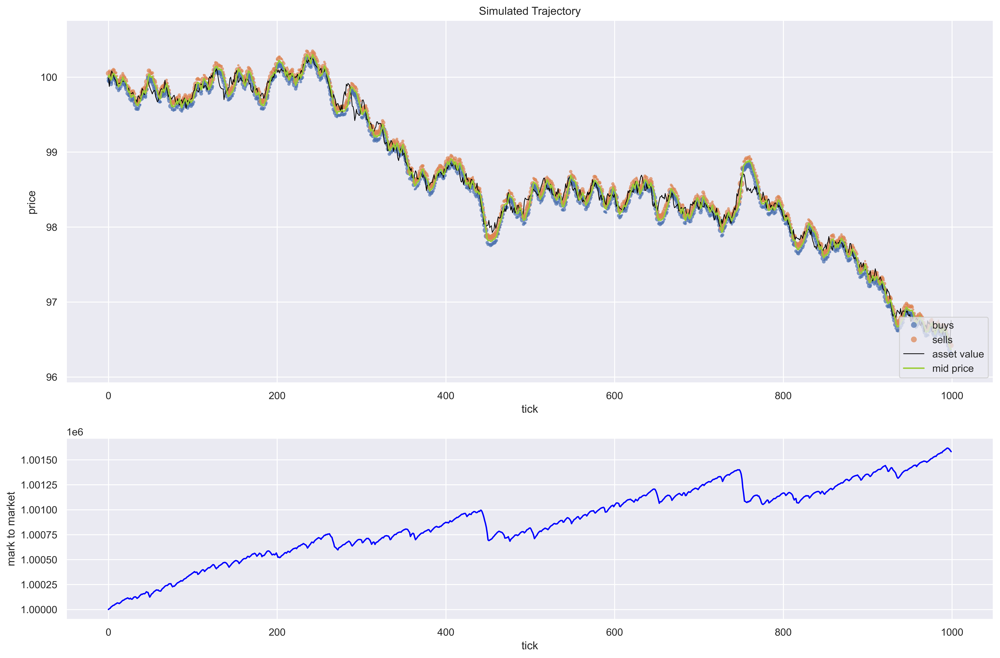
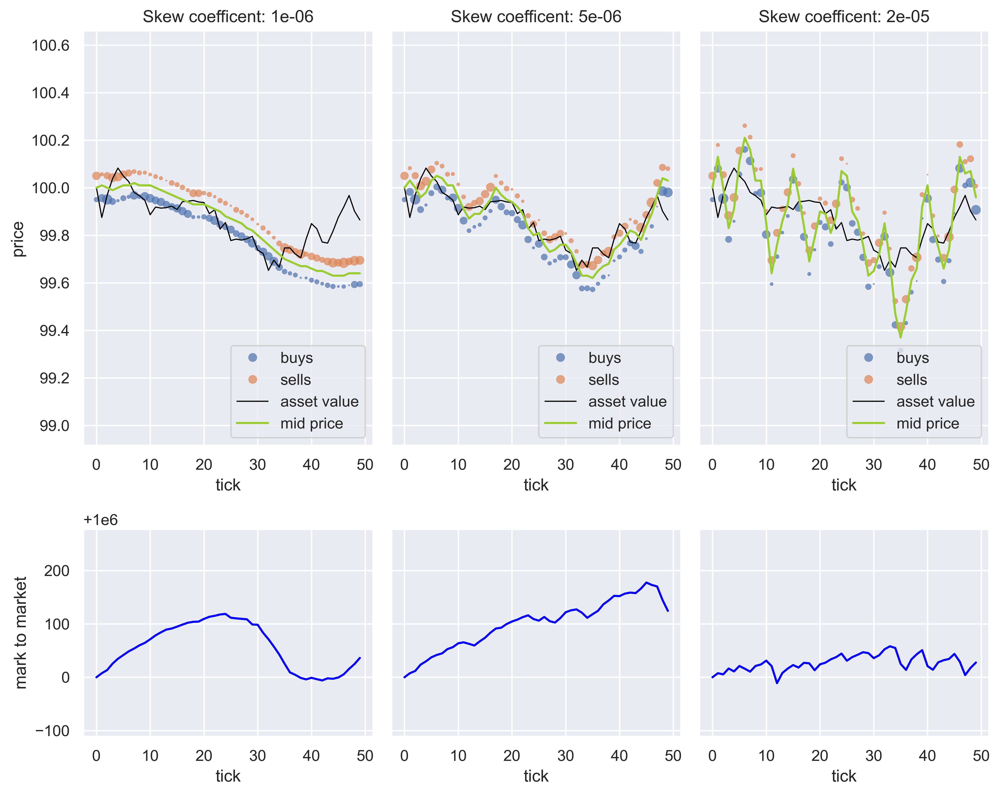

# Endogenous Pricing Market Simulation

Now that the limit order book correctly matches trades we can use it for some micro-structure simulations. I simulated a market with two different agents: a monopolistic market maker which generates tick-by-tick quotes, and informed order flow which trades in the direction of the asset's fundamental price with a certain probability. (This could be interpreted as a three agent simulation with informed traders who always trade in the direction of the asset's fundamental price and uninformed noise traders.) 

Most academic models (e.g. Avellaneda–Stoikov) assume a stochastic environment driver: the mid price evolves as an Ito process. Most simple simulations also proceed with a stochastic mid price method; the market maker quotes around an exogenous — with cause external to the simulation —  mid price. This is useful for establishing closed forms for optimal market makers or investigating optimal spreads, however, I was interested understanding what role market makers actually play in the markets. Primarily I wanted to see how a profit making imperative leads to price discovery.

## Endogenous Pricing

In order to investigate price discovery there could be no stochastically evolving mid-price directly observable by the market maker. I implemented the smallest possible setup with information disparity between actors. 

- Informed traders have access to the asset's fundamental value and trade accordingly.
- A monopolistic market maker posts two quotes at a given (and fixed) spread with the aim of capturing it.

The key mechanism of price discovery is that **information is transferred from discretionary traders to the market maker via toxic inventory buildup**. Simply put, if the market maker overvalues an asset, informed traders sell the stock at the inflated price and the market maker builds inventory that would make a loss if the price corrected. So the market maker attempts to protect against such losses by **managing inventory**. The cost imposed by informed traders correctly placing trades to the disadvantage of market makers is known as **adverse selection cost**.

## Market Maker Model

In my simple market maker model inventory management is achieved with a linear skew: if the market maker builds exposure on one side it skews price in order to unwind inventory. The larger the exposure the more aggressively the market maker attempts to unwind. The amount of skew for a given unit of exposure is determined by a coefficient which we call the skew coefficient. 

Let the skew coefficient be $c$. Let bid quote and ask quote for the period [t, t+1) be $B_t$ and $A_t$ respectively. Let the fixed spread be $s$.
Then the market maker quotes are determined: 

$$
\begin{align*}
B_t &= \text{mid price}_t - \frac{s}{2} - c * \text{signed exposure} \\
A_t &= \text{mid price}_t + \frac{s}{2} - c * \text{signed exposure}
\end{align*}
$$

## Informed flow model 

Informed order arrivals are modelled as a poisson process. Each order has uniformly distributed integer volume and is modelled as a market order: it crosses the spread regardless of price. Each order has a fixed probability of trading in the direction of the fundamental asset value. 

The fundamental asset value is itself modelled as a random walk with normally distributed independent increments.

It turns out this is enough to achieve endogenous pricing!

## Effect of the skew coefficient and efficient pricing imperative
In the above plot, I tuned the skew parameter such that the mid price roughly followed the fundamental asset value. However, it turns out that correct pricing is compelled by profit motive. This is the key mechanistic insight. A few more exploratory plots comparing mark-to-market performance (PnL) of market makers with different skew coefficients illustrates the point. The fundamental asset evolution and informed trader fraction remain constant.

If the skew coefficient is too low, the market maker reacts slowly to the mispricing signal and the mid-price doesn't properly reflect asset's true value. Crucially, the market maker pays a price for getting it wrong which is reflected in its returns. 

If the skew coefficient is too high, the market maker overreacts to toxic inventory and overshoots the fundamental value. This leads to saw-tooth oscillations that aren't present in the asset's fundamental value. Again the market maker pays the price: it makes barely any money at all. 

The most successful long term strategy for this simple market maker seems to coincide with efficient (read correct) pricing!

This conclusion, which follows organically from the simulation setup and endogenous pricing mechanics gives us deep insight into what market makers actually do. They provide liquidity to traders yes, but improtantly in providing that liquidity they act as the medium by which a market may discover the true price of an asset by aggreggating the opinions of many discretionary traders.