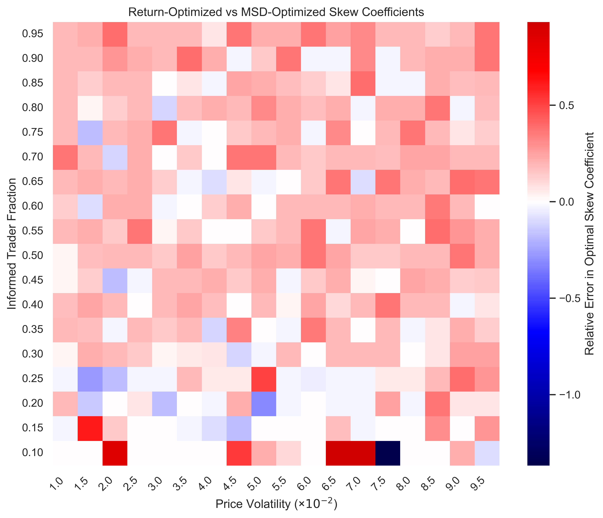

# Endogenous Pricing and Market Maker Profit Maximization

# Introduction

Market makers are often described as liquidity providers, but this characterization obscures their deeper function in price discovery. A fundamental question in market microstructure is: what mechanism compels market makers to set efficient prices?

Most academic models (e.g., Avellaneda–Stoikov) assume the mid-price evolves exogenously as an Ito process, treating it as an external environmental factor to which the market maker responds. While this framework is useful for deriving closed-form optimal strategies, it sidesteps the question of how prices come to reflect fundamental value in the first place. If market makers simply quote around an externally given mid-price, they are passive participants in price formation rather than active contributors to price discovery.
This report investigates price formation through an endogenous pricing framework where no stochastically evolving mid-price is directly observable to the market maker. Instead, the market maker must discover the asset's fundamental value through the only signal available: the inventory consequences of its trading decisions. The central hypothesis is that profit maximization naturally compels efficient pricing—that is, a market maker optimizing for long-run profitability will converge toward quoting prices that accurately reflect the asset's fundamental value.

## Model Setup
The simulation employs the minimal possible setup to observe endogenous price discovery:

**Informed Traders:** Have access to the asset's fundamental value, which evolves as a random walk with normally distributed increments. Order arrivals follow a Poisson process with uniformly distributed integer volumes. Each order is a market order that crosses the spread. Crucially, each order has probability p of trading in the direction of the fundamental value (informed flow) and probability 1-p of trading against it (noise flow).

**Monopolistic Market Maker:** Posts two-sided quotes at a fixed spread s with no direct observation of the fundamental value. The market maker's only information channel is the inventory built from trading with informed and uninformed order flow. To manage inventory risk, the market maker employs a linear skewing strategy:

$$
\begin{align*}
B_t &= \text{mid}_t - \frac{s}{2} - c \cdot I_t \cdot \text{mid}_t  \\
A_t &= \text{mid}_t + \frac{s}{2} - c \cdot I_t \cdot \text{mid}_t
\end{align*}
$$

Where $c$ is the skew coefficient and $I_t$ is the signed inventory position (so that $I_t \cdot \text{mid}_t$ is the signed dollar exposure).

The mechanism of price discovery is adverse selection: when the market maker overvalues an asset, informed traders sell at the inflated price, causing toxic inventory accumulation that would realize losses if prices corrected. The market maker's skewing response to this inventory buildup constitutes its pricing adjustment toward fundamental value.

## Illustrative Example
The following simulation demonstrates that the mechanism can produce endogenous pricing. With an appropriately calibrated skew coefficient, the market maker's mid-price tracks the fundamental asset value despite having no direct observation of it:

Notably, the market maker achieves positive mark-to-market returns, suggesting that its pricing strategy—derived purely from inventory management—successfully navigates the adverse selection imposed by informed traders. This raises two critical questions that we investigate in the subsequent analysis:

**Optimal Skewing:** How does the optimal skew coefficient depend on market conditions (volatility, informed trader fraction)?

**Efficiency and Profit:** Is efficient pricing indeed the profit-maximizing strategy, or is this an artifact of particular parameter choices?

The remainder of this report addresses these questions through systematic experimentation, demonstrating that profit-driven market making endogenously produces efficient price discovery.

## Optimal Skewing

An exploratory plot of trajectories indicates that the correct skew coefficient makes the market maker sensitive enough to inventory accumulation that it may follow the fundamental value of the asset well, and yet doesn't overreact to a weak signal. In economic terms, the market maker must be sufficiently willing to unwind a position if it looks like the fundamental value has deviated from the mid-price, but musn't overpay in order to unwind.

We might expect, therefore, that:
1) High asset volatility implies a higher optimal skew coefficient; the market maker must be more sensitive to the signal to be able to follow the higher volatility asset trajectory.
2) Higher informed trader fraction implies a lower optimal skew coefficient; the pricing signal is stronger and so the market maker can be less sensitive and still follow the asset trajectory. 

### Methodology

I use monte-carlo simulation and a simple but effective grid search to optimise the skew coefficient in different market regimes. I find optimal skew coefficients and the value of two different metrics at the optimal skew at 324 different market regimes $(\sigma, \gamma)$, where $\sigma = \{0.005 + 0.005i\}_{i=1}^18$ represents the market volatility and $\gamma = \{0.05 + 0.05\}_{i=1}^18$ represents the fraction of informed traders. 

At each regime point I execute a two step grid search: coarse grid, fine grid. Some cursory grid based optimisation suggested that the optimal coefficient was related to the two regime variables by a power law, so I conduct the search with a log-linear grid. At each point in the parameter space $(\sigma, \gamma, c)$ I simulate $5$ trajectories and take the average of the desired optimisation metric accross those 5 paths. 

For the full experiment choose a 20 point coarse grid and a 10 point fine grid, therefore the total number of simulated trajectories is 48600. For each simulated trajectory, an L3 limit order book is generated and matching logic is performed on an average of 12,500 market orders. The experiment is, therefore, computationally expensive. To make the computation feasible on my laptop, I seperate the load into tasks by market regime, and execute each task in parallel.

### Results 

The results confirm the expected behaviour, when we optimise by returns and final mark to market position. In fact, the optimal returns skew coefficient and the optimal final mark to market are identical. Below is the heat map for the more robust metric of average returns

The two tables below verify that for fixed informed fraction, higher asset value volatility compels a higher skew coefficient, and for fixed asset value volatility higher ifnormed fraction requires a lower skew coefficient. 

**Fixed Informed Fraction (0.5)**

|   price volatility |   optimal sc-returns |   average returns |        final pnl |
|-------------------:|---------------------:|------------------:|-----------------:|
|               0.02 |          2.56659e-06 |       4.85518e-06 |      1.00486e+06 |
|               0.04 |          5.31063e-06 |       2.80603e-06 |      1.00281e+06 |
|               0.06 |          8.62328e-06 |       7.37347e-07 |      1.00074e+06 |
|               0.08 |          1.12884e-05 |      -1.16342e-06 | 998838           |

**Fixed Price Volatility (0.05)**

|   informed fraction |   optimal sc-returns |   average returns |        final pnl |
|--------------------:|---------------------:|------------------:|-----------------:|
|                 0.2 |          1.09884e-05 |       3.67679e-06 |      1.00368e+06 |
|                 0.4 |          8.62328e-06 |       2.56539e-06 |      1.00257e+06 |
|                 0.6 |          6.24197e-06 |       9.9548e-07  |      1.001e+06   |
|                 0.8 |          5.31063e-06 |      -8.19639e-07 | 999181           |

A further interesting observation evident from the heatmap is that along optimal skew coefficient level sets, higher volatility and higher informed fraction reduce returns. This makes sense: a higher informed fraction increases the adverse selection cost while decreasing the opportunity for 'free' spread capture from uninformed traders, while a higher volatility increases the inventory risk and thus the optimal market maker has higher costs associated with inventory management.

This last remark becomes more intuitive when combined with the hypothesis, which we confirm in the following section, that an optimally perfoming market maker in the defined regime also discovers price optimally.

Finally we fit a power model regression (log-log) that determines the optimal skew coefficient as a function of the market regime. As the preliminary results suggested the fit of such a model is very good: the $R^2$ value is 0.958, and the $t$ statistics are very large.

Fitting: $\log(c^*) \sim \beta_0 + \beta_1 \cdot \log(\gamma) + \beta_2 \cdot \log(\sigma)$

| Variable | Coefficient | Std Error | t-statistic | P>\|t\| |
|----------|-------------|-----------|-------------|-------|
| const | -9.2612 | 0.0452 | -204.766 | 0.0000 |
| informed fraction | -0.5837 | 0.0138 | -42.309 | 0.0000 |
| price volatility | 1.0278 | 0.0138 | 74.497 | 0.0000 |

- R-squared: 0.9581
- Adjusted R-squared: 0.9578
- F-statistic: 3669.94

Plotting the model and the data side by side confirms visually the goodness of fit.

Plotting the residuals shows a slight but not catastrophic heteroskedasticity.

## Efficiency and Profit

We believed at the beginning of the investigation that price-discovery and profit motive were aligned. This belief would be vindicated if the skew coefficient for optimally efficient price-discovery and that for optimal returns were the same or close. 

Plotting the optimal skew coefficient heat maps for different market regimes side by side we can see that this is indeed the case.

Plotting the relative differences $\frac{c^*_{returns} - c^*_{msd}}{c^*_{returns}}$ shows that the difference in optimal skew is mostly under a single percentage point.

Indeed the average relative difference in skew is ~ 0.1%

| Metric | Mean | Std | Min | Max |
|--------|------|-----|-----|-----|
| *optimal sc-returns* vs *optimal sc-msd* (rel diff) | 1.388757e-01 | 1.783728e-01 | -1.367386e+00 | 9.304807e-01 |

